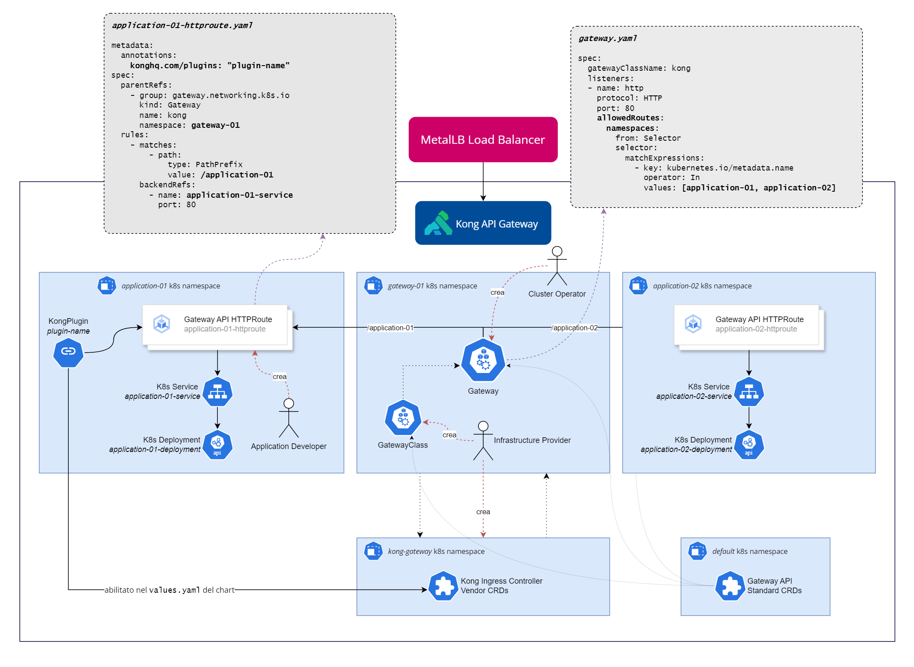

### Cross-referencing namespaces when using the Kubernetes Gateway API

- [Gateway API SIG](https://gateway-api.sigs.k8s.io/)
- [Gateway API Reference](https://gateway-api.sigs.k8s.io/api-types/gateway/)
- [Introduction to ReferenceGrants](https://gateway-api.sigs.k8s.io/api-types/referencegrant/)
- [ReferenceGrants API](https://gateway-api.sigs.k8s.io/reference/spec/#gateway.networking.k8s.io/v1alpha2.ReferenceGrant)

> Nei seguenti scenari, è possibile immaginare un'architettura del tutto analoga (in termini di namespacing) sostituendo gli Operator con degli Ingress Controller.

#### Scenario 1

In questo scenario, viene segregata la definizione del gateway e il suo ciclo di controllo (namespace `gateway-operator`) dal provisioning del gateway stesso (namespace `gateway-01`) e dai namespace delle applicazioni, che a loro volta contengono oggetti proprietari (come `Services`, `Deployments`, `Operators` di Kubernetes, ...) *e* un `ReferenceGrant`, che consente a `HTTPRoutes` di fare riferimento a `Services` posizionati in un namespace diverso (cioè il namespace che ospita il `ReferenceGrant`). 

Ciò significa che agli sviluppatori di applicazioni dovrebbero essere concessi poteri RBAC su tutti i tipi di oggetti (tranne i `ReferenceGrant`) negli spazi dei nomi `application-01` e `application-02` (per esempio, si potrebbero limitare tutte le azioni sul gruppo di API `gateway.networking.k8s.io/*`).

```
{namespace} gateway-operator
├─ Gateway CRDs
├─ [Other objects...]

{namespace} gateway-01
├─ GatewayConfiguration
├─ GatewayClass
├─ Gateway
├─ HTTPRoutes
    ├─ application-01-httproute
    ├─ application-02-httproute

{namespace} application-01 [exposed via gateway-01]
├─ Service
├─ Deployment
├─ [Other objects...]
├─ ReferenceGrant
    ├─ application-01-httproute-grant

{namespace} application-02 [exposed via gateway-01]
├─ Service
├─ Deployment
├─ [Other objects...]
├─ ReferenceGrant
    ├─ application-02-httproute-grant

```

### Scenario 2



Come illustrato in [questo post del blog](https://konghq.com/blog/engineering/sending-traffic-across-namespaces-with-gateway-api) dal team di Kong, è possibile un'alternativa più *concisa*. 

In questo scenario, è necessario configurare l'oggetto `Gateway` nel namespace `gateway-01` indicando da quali (differenti) namespace voler accettare esplicitamente connessioni (e.g. `HTTPRoutes`). 

Negli esempi presenti in `scenarios/scenario-2-kong-examples`, i `backendRefs` nelle `HTTPRoutes` non hanno un namespace *esplicito*: ciò significa che il namespace è lo stesso dell'oggetto `HTTPRoute`.

Quindi, si configura l'oggetto `Gateway` per accettare specifici namespace; poi si crea un `HTTPRoute` *all'interno* di ciascuno di questi namespace, specificando nelle `HTTPRoute` in quale namespace giace l'oggetto `Gateway` (dato che ora sono in namespace diversi).

Questa è una soluzione più elegante e semplice e implica anche che gli sviluppatori di applicazioni possano godere di permessi RBAC più libertini sui namespace che gestiscono.

```
{namespace} gateway-operator
├─ Gateway CRDs
├─ [Other objects...]

{namespace} gateway-01
├─ GatewayConfiguration
├─ GatewayClass
├─ Gateway

{namespace} application-01 [exposed via gateway-01]
├─ Service
├─ Deployment
├─ [Other objects...]
├─ HTTPRoutes
    ├─ application-01-httproute

{namespace} application-02 [exposed via gateway-01]
├─ Service
├─ Deployment
├─ [Other objects...]
├─ HTTPRoutes
    ├─ application-02-httproute

```