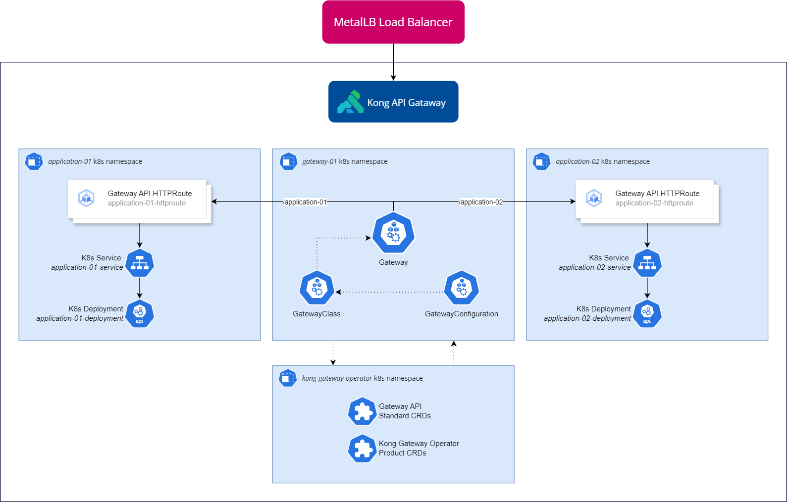

### Cross-referencing namespaces when using the Kubernetes Gateway API

- [Gateway API SIG](https://gateway-api.sigs.k8s.io/)
- [Gateway API Reference](https://gateway-api.sigs.k8s.io/api-types/gateway/)
- [Introduction to ReferenceGrants](https://gateway-api.sigs.k8s.io/api-types/referencegrant/)
- [ReferenceGrants API](https://gateway-api.sigs.k8s.io/reference/spec/#gateway.networking.k8s.io/v1alpha2.ReferenceGrant)


#### Scenario 1

In this scenario, you segregate the gateway definition and control loop (the `gateway-operator` namespace) from the gateway provisioning (the `gateway-01` namespace) and the application namespaces, which themselves contain proprietary objects (such as Kubernetes `Services`, `Deployments`, `Operators`, ...) *and* a `ReferenceGrant`, which allows `HTTPRoutes` to reference `Services` positioned in a different namespace (i.e. the namespace which hosts the `ReferenceGrant`, that is). 

This means that application developers should be granted RBAC powers over all object kinds (except `ReferenceGrants`) in the `application-01` and `application-02` namespaces (for instance, you could possibly limit all actions over the `gateway.networking.k8s.io/*` API group).

```
{namespace} gateway-operator
├─ Gateway CRDs
├─ [Other objects...]

{namespace} gateway-01
├─ GatewayConfiguration
├─ GatewayClass
├─ Gateway
├─ HTTPRoutes
    ├─ application-01-httproute
    ├─ application-02-httproute

{namespace} application-01 [exposed via gateway-01]
├─ Service
├─ Deployment
├─ [Other objects...]
├─ ReferenceGrant
    ├─ application-01-httproute-grant

{namespace} application-02 [exposed via gateway-01]
├─ Service
├─ Deployment
├─ [Other objects...]
├─ ReferenceGrant
    ├─ application-02-httproute-grant

```

### Scenario 2



As exihibited in [this blog post](https://konghq.com/blog/engineering/sending-traffic-across-namespaces-with-gateway-api) from the Kong team, a more *concise* alternative is possible. 

In this scenario, you must configure the `Gateway` object in the gateway-01 namespace to explicitly accept which namespaces are allowed in the `HTTPRoutes` backendRefs definition. In the examples in `scenarios/scenario-2-kong-examples`, `backendRefs` in the `HTTPRoutes` do not have an *explicit* namespace -- this means that the namespaces is the same as the `HTTPRoute` object itself.

Thus, we configure the `Gateway` object to accept specific namespaces; then, we create a `HTTPRoute` *inside each* of those namespaces, while also specifying in which namespace the `Gateway` object resides in (as now they are in different namespaces).

This is a more elegant and straight-forward solution, and also implies that application developers could have more loose RBAC permissions over their managed namespaces.

```
{namespace} gateway-operator
├─ Gateway CRDs
├─ [Other objects...]

{namespace} gateway-01
├─ GatewayConfiguration
├─ GatewayClass
├─ Gateway

{namespace} application-01 [exposed via gateway-01]
├─ Service
├─ Deployment
├─ [Other objects...]
├─ HTTPRoutes
    ├─ application-01-httproute

{namespace} application-02 [exposed via gateway-01]
├─ Service
├─ Deployment
├─ [Other objects...]
├─ HTTPRoutes
    ├─ application-02-httproute

```